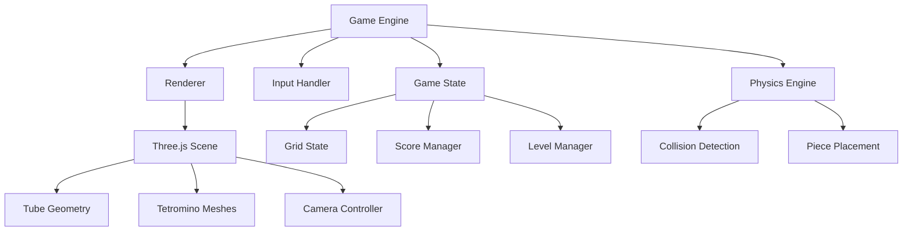

# Design Document

## Overview

The 3D Tube Tetris game will be implemented as a web-based application using Three.js for 3D rendering and TypeScript for type safety. The core innovation is replacing the traditional 2D grid with a cylindrical tube where tetrominoes fall vertically while the tube rotates horizontally to position pieces.

## Architecture

### High-Level Architecture



### Core Systems

1. **Rendering System**: Three.js-based 3D renderer with custom shaders for visual effects
2. **Game Logic System**: Manages game state, scoring, and level progression
3. **Physics System**: Handles piece falling, collision detection, and tube rotation
4. **Input System**: Processes player input and translates to game actions
5. **Audio System**: Manages sound effects and background music

## Components and Interfaces

### Core Classes

#### `TubeGeometry`
```typescript
class TubeGeometry {
  radius: number;
  height: number;
  segments: number; // Number of segments around circumference
  
  constructor(radius: number, height: number, segments: number);
  getSegmentAngle(segment: number): number;
  getWorldPosition(segment: number, row: number): Vector3;
}
```

#### `Tetromino`
```typescript
interface TetrominoShape {
  blocks: Vector2[]; // Relative positions of blocks
  color: Color;
  type: TetrominoType;
}

class Tetromino {
  shape: TetrominoShape;
  position: Vector3; // World position
  rotation: number; // Standard tetromino rotation (0, 90, 180, 270)
  
  rotate(): void;
  getBlockPositions(): Vector3[];
}
```

#### `TubeGrid`
```typescript
class TubeGrid {
  segments: number; // Circumference segments
  rows: number; // Height rows
  grid: (Tetromino | null)[][]; // [segment][row]
  
  isOccupied(segment: number, row: number): boolean;
  placePiece(tetromino: Tetromino, tubeRotation: number): void;
  checkCompleteRings(): number[];
  clearRings(rings: number[]): void;
}
```

#### `GameEngine`
```typescript
class GameEngine {
  scene: Scene;
  camera: PerspectiveCamera;
  renderer: WebGLRenderer;
  tubeGrid: TubeGrid;
  currentPiece: Tetromino;
  tubeRotation: number; // Current tube rotation in radians
  
  init(): void;
  update(deltaTime: number): void;
  render(): void;
  rotateTube(direction: number): void;
  dropPiece(): void;
}
```

### Key Interfaces

#### `InputController`
```typescript
interface InputController {
  onRotateLeft(): void;
  onRotateRight(): void;
  onSoftDrop(): void;
  onHardDrop(): void;
  onRotatePiece(): void;
}
```

## Data Models

### Coordinate System

The game uses a hybrid coordinate system:
- **Tube Coordinates**: (segment, row) where segment is 0 to segments-1 around circumference
- **World Coordinates**: Standard Three.js 3D coordinates for rendering
- **Tube Rotation**: Single rotation value applied to entire tube geometry

### Grid Representation

```typescript
type GridCell = {
  occupied: boolean;
  tetromino?: Tetromino;
  color?: Color;
};

type TubeGridState = GridCell[][];
```

### Game State

```typescript
interface GameState {
  score: number;
  level: number;
  linesCleared: number;
  currentPiece: Tetromino;
  nextPiece: TetrominoType;
  tubeRotation: number;
  fallSpeed: number;
  gameOver: boolean;
  paused: boolean;
}
```

## Error Handling

### Collision Detection
- **Boundary Checking**: Ensure pieces don't fall outside tube bounds
  - Article: [Collision Detection in Game Development](https://developer.mozilla.org/en-US/docs/Games/Techniques/2D_collision_detection)
  - Guide: [3D Collision Detection Algorithms](https://www.realtimerendering.com/intersections.html)
- **Overlap Detection**: Prevent pieces from occupying same grid cells
  - Reference: [Spatial Partitioning for Collision Detection](https://gameprogrammingpatterns.com/spatial-partition.html)
- **Rotation Validation**: Check if piece rotation is valid at current position
  - Article: [Tetris Rotation Systems](https://tetris.fandom.com/wiki/SRS)

### Input Validation
- **Rate Limiting**: Prevent excessive input that could break game state
  - Article: [Input Handling in Game Development](https://gameprogrammingpatterns.com/command.html)
  - Guide: [Debouncing and Throttling in JavaScript](https://css-tricks.com/debouncing-throttling-explained-examples/)
- **State Validation**: Ensure inputs are only processed during valid game states
  - Pattern: [State Machine Pattern](https://gameprogrammingpatterns.com/state.html)
- **Boundary Checks**: Validate all movement and rotation commands
  - Reference: [Input Validation Best Practices](https://owasp.org/www-project-cheat-sheets/cheatsheets/Input_Validation_Cheat_Sheet.html)

### Rendering Errors
- **WebGL Context Loss**: Implement context restoration
  - Reference: [WebGL Context Loss Handling](https://www.khronos.org/webgl/wiki/HandlingContextLost)
  - Guide: [Three.js Context Loss Recovery](https://threejs.org/examples/#webgl_materials_envmaps_hdr)
- **Resource Loading**: Handle failed texture/model loading gracefully
  - Reference: [Three.js Loading Manager](https://threejs.org/docs/#api/en/loaders/LoadingManager)
  - Article: [Error Handling in Asset Loading](https://web.dev/loading-web-workers/)
- **Performance Degradation**: Implement fallback rendering modes
  - Guide: [Progressive Enhancement in WebGL](https://web.dev/webgl-fundamentals/)
  - Reference: [Three.js Renderer Capabilities](https://threejs.org/docs/#api/en/renderers/WebGLRenderer)

## Testing Strategy

### Unit Tests
- **TubeGrid Logic**: Test grid operations, line clearing, collision detection
  - Framework: [Jest Testing Framework](https://jestjs.io/docs/getting-started)
  - Guide: [Testing Game Logic](https://gamedev.stackexchange.com/questions/67508/how-to-unit-test-game-logic)
- **Tetromino Behavior**: Test piece rotation, movement, and placement
  - Article: [Testing Object-Oriented Game Components](https://martinfowler.com/articles/mocksArentStubs.html)
- **Coordinate Conversion**: Test conversion between tube and world coordinates
  - Guide: [Testing Mathematical Functions](https://jestjs.io/docs/expect#tobeCloseTonumber-numdigits)
- **Game State Management**: Test scoring, level progression, game over conditions
  - Pattern: [Testing State Machines](https://kentcdodds.com/blog/how-to-test-a-custom-hook)

### Integration Tests
- **Rendering Pipeline**: Test Three.js scene setup and rendering
  - Tool: [Puppeteer for WebGL Testing](https://pptr.dev/)
  - Guide: [Testing Three.js Applications](https://threejs.org/docs/#manual/en/introduction/How-to-run-things-locally)
- **Input Processing**: Test input handling and game response
  - Framework: [Testing Library User Events](https://testing-library.com/docs/user-event/intro/)
- **Physics Integration**: Test piece falling and collision systems
  - Article: [Integration Testing for Game Systems](https://gamedev.net/tutorials/programming/general-and-gameplay-programming/integration-testing-for-games-r4902/)
- **Audio Integration**: Test sound effect triggering
  - Guide: [Testing Web Audio API](https://developer.mozilla.org/en-US/docs/Web/API/Web_Audio_API/Using_Web_Audio_API)

### Visual Tests
- **Camera Positioning**: Verify entire tube circumference is visible
  - Tool: [Visual Regression Testing with Percy](https://percy.io/)
  - Guide: [Screenshot Testing for WebGL](https://github.com/mapbox/pixelmatch)
- **Piece Rendering**: Ensure tetrominoes maintain horizontal orientation
  - Article: [Automated Visual Testing](https://applitools.com/blog/automated-visual-testing/)
- **Tube Rotation**: Verify smooth rotation animations
  - Tool: [Chrome DevTools Animation Inspector](https://developer.chrome.com/docs/devtools/css/animations/)
- **Line Clearing**: Test visual feedback for completed rings
  - Framework: [Storybook for Component Testing](https://storybook.js.org/docs/react/writing-tests/visual-testing)

### Performance Tests
- **Frame Rate**: Maintain 60fps during normal gameplay
  - Tool: [Chrome DevTools Performance Tab](https://developer.chrome.com/docs/devtools/performance/)
  - Guide: [Web Performance Monitoring](https://web.dev/user-centric-performance-metrics/)
- **Memory Usage**: Monitor for memory leaks during extended play
  - Tool: [Chrome DevTools Memory Tab](https://developer.chrome.com/docs/devtools/memory/)
  - Article: [Debugging Memory Leaks in JavaScript](https://nolanlawson.com/2020/02/19/fixing-memory-leaks-in-web-applications/)
- **Rendering Optimization**: Test with maximum pieces on screen
  - Reference: [Three.js Performance Monitoring](https://threejs.org/examples/#misc_controls_stats)
  - Tool: [WebGL Inspector](https://benvanik.github.io/WebGL-Inspector/)

## Technical Considerations

### Three.js Implementation
- Use `CylinderGeometry` for the tube base structure
  - Reference: [Three.js CylinderGeometry Documentation](https://threejs.org/docs/#api/en/geometries/CylinderGeometry)
  - Guide: [Creating Custom Geometries in Three.js](https://threejs.org/manual/#en/custom-geometry)
- Implement custom materials for visual distinction between placed and active pieces
  - Reference: [Three.js Materials Documentation](https://threejs.org/docs/#api/en/materials/Material)
  - Guide: [Three.js Material System](https://threejs.org/manual/#en/materials)
- Use `InstancedMesh` for efficient rendering of multiple tetromino blocks
  - Reference: [Three.js InstancedMesh Documentation](https://threejs.org/docs/#api/en/objects/InstancedMesh)
  - Article: [Efficient Rendering with InstancedMesh](https://threejs.org/examples/#webgl_instancing_performance)
- Implement smooth camera transitions and tube rotation animations
  - Reference: [Three.js Animation System](https://threejs.org/docs/#api/en/animation/AnimationMixer)
  - Guide: [Three.js Animation and Tweening](https://threejs.org/manual/#en/animation)

### Coordinate Mapping
- Convert between cylindrical coordinates (angle, height) and Cartesian coordinates
  - Reference: [Three.js Vector3 and Cylindrical Coordinates](https://threejs.org/docs/#api/en/math/Cylindrical)
  - Article: [Coordinate System Transformations in 3D Graphics](https://learnopengl.com/Getting-started/Coordinate-Systems)
- Handle wrapping around tube circumference for piece placement
  - Guide: [Modular Arithmetic for Circular Arrays](https://developer.mozilla.org/en-US/docs/Web/JavaScript/Reference/Operators/Remainder)
- Maintain consistent visual representation during tube rotation
  - Reference: [Three.js Object3D Rotation](https://threejs.org/docs/#api/en/core/Object3D.rotation)

### Performance Optimization
- Use object pooling for tetromino pieces to reduce garbage collection
  - Article: [Object Pooling in JavaScript Games](https://gameprogrammingpatterns.com/object-pool.html)
  - Guide: [Memory Management in Three.js](https://threejs.org/manual/#en/cleanup)
- Implement frustum culling for pieces outside camera view
  - Reference: [Three.js Frustum Documentation](https://threejs.org/docs/#api/en/math/Frustum)
  - Article: [Frustum Culling Techniques](https://learnopengl.com/Guest-Articles/2021/Scene/Frustum-Culling)
- Use LOD (Level of Detail) for distant pieces if needed
  - Reference: [Three.js LOD Documentation](https://threejs.org/docs/#api/en/objects/LOD)
  - Example: [Three.js LOD Implementation](https://threejs.org/examples/#webgl_lod)
- Optimize shader usage for consistent frame rates
  - Guide: [Three.js Shader Optimization](https://threejs.org/manual/#en/optimize-lots-of-objects)
  - Reference: [WebGL Performance Best Practices](https://developer.mozilla.org/en-US/docs/Web/API/WebGL_API/WebGL_best_practices)